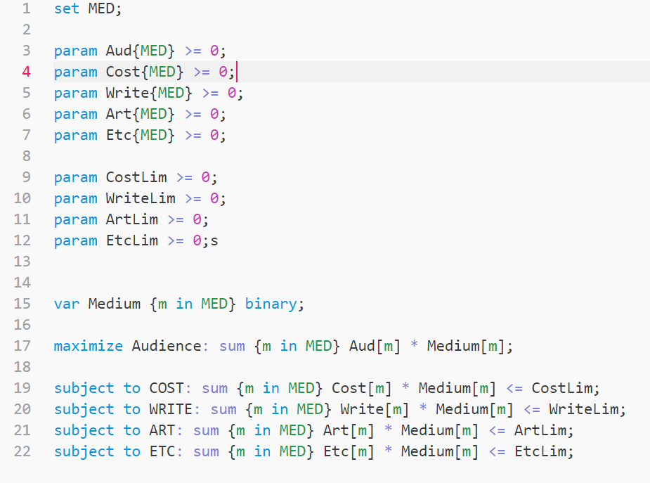

# AMPL Syntax README

A basic package for syntax highlighting AMPL code in VSCode. This is refactored code from m-paolino on [Github](https://github.com/m-paolino/atom-package-language-ampl-syntax) which was originally made for the Atom text editor.

## Features

Highlights syntax for AMPL in VSCode.

1. Can add to or remove from each one of the three syntaxes in the syntaxes file in the code. 

2. Completion and highlighting for most AMPL terms. 

## Known Issues

Please test and edit. I just wanted to share code that I had made for anyone else who wanted to use it.

## Release Notes

Users appreciate release notes as you update your extension.

### 1.0.0

Initial release

-----------------------------------------------------------------------------------------------------------
